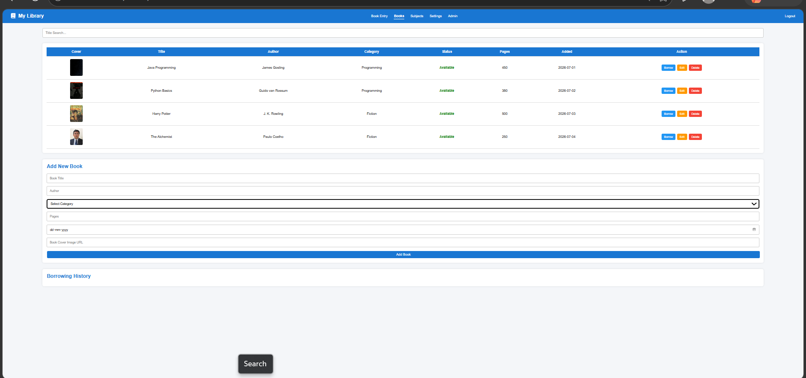

# 📚 Personal Book Library

## Description
Personal Book Library is a web application developed using HTML5, CSS3, and JavaScript.

## Features
- Add Book
- Search Book
- Book Categories
- Borrow & Return
- Edit Book
- Delete Book
- Borrowing History
- Local Storage

## Technologies Used
- HTML5
- CSS3
- JavaScript

## Project Structure

CrixsoftSolution_BookLibrary/
│── index.html
│── style.css
│── script.js
└── screenshots/
    └── output.png

## Output

## Author

**Lavanya**
